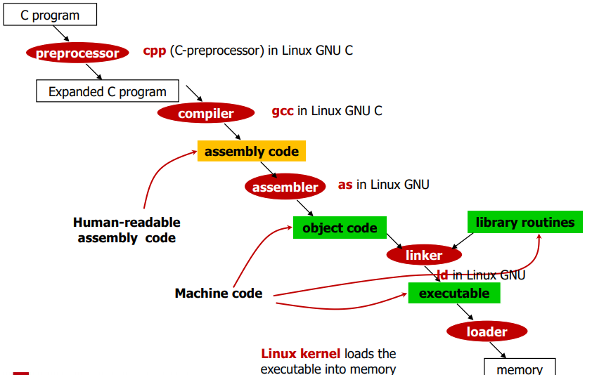

# Computer Basic

> 2020.10.29

## 1. Basic Concept

### 1.1 HW/SW Stack in Computer

- Applicatios : Application SW로, High-level language로 쓰여진다.
- System software 
  - Compilers : High-level language를 Machine code로 번역한다.
  - Operating systems : Input/Output을 다루며, memory management, task scheduling & sharing resources의 일을 한다.
- BIOS : Basic Input/Output System
- Instruction Set Architecture(ISA)  : HW와 Low-level language 사이의 interface
- Computer Hardware : Processor, Memory, I/O controllers

### 1.2 Instruction

- 쉽게 말해 명령어라고 칭하며, 컴퓨터 언어의 말들이다.
- Instruction(명령어)의 집합체를 **Instruction Set**이라 한다.
- CPU마다 Instruction set이 다르다.

### 1.3 High-level Code to Assembly to Executable

[출처] : 서울과학기술대학교 전자IT미디어공학과 컴퓨터구조 수업자료

- compiler와 assembler에 의해 binary data 번역된 Instructions와 data가 메모리에 저장되며, CPU는 이를 실행하기 위해 fetch한다.

### 1.4 CrossCompiler

- 위에서 언급했듯이, CPU마다 사용하는 Instruction set이 다르다고 했다. 그러면 MIPS를 사용하기 위해서는  MIPS machice이 필수적으로 있어야 하나??
- 이러한 문제를 해결해주는 것이 **CrossCompiler**이다.
- **CrossCompiler**는 compile 하려는 플랫폼을 다른  compiler로 compile하는 것이다.