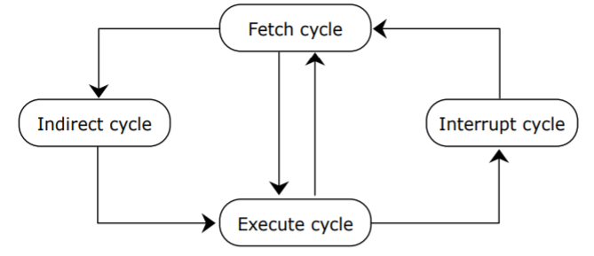

# CPUMechanism

> 2020.11.02


## CPU 작동 원리

> CPU는 컴퓨터에서 가장 핵심적인 역할을 수행하는 부분으로 크게 연산장치, 제어장치, 레지스터 3가지로 구성된다.


- 연산장치
  - 산순연산과 논리연산을 수행하여 산술논리연산장치(ALU)라고 불리며, 연산에 필요한 데이터를 레지스터에서 가져오고, 연산 결과를 다시 레지스터로 보낸다.

- 제어장치
  - 명령어를 순서대로 실행할 수 있도록 제어하는 장치
  - 주기억장치에서 프로그램 명령어를 꺼내 해독하고, 그 결과에 따라 실행에 필요한 제어 신호를 기억장치, 연산장치, 입출력장치로 보낸다.
  - 또한, 이들 장치가 보낸 신호를 받아, 다음에 수행할 동작을 결정한다.
- 레지스터
  - 명령어 주소, 연산에 필요한 데이터, 연산 결과 등을 임시로 저장하는 고속기억장치이다.
  - 용도에 따라 범용 레지스터와 특수목적 레지스터로 구분된다.
  - 범용 레지스터 : 연산에 필요한 데이터나 연산 결과를 임시로 저장
  - 특수목적 레지스터 : 특별한 용도로 사용하는 레지스터


**특수목적 레지스터**

- MAR(Memory Address Register) : 읽기/쓰기 연산을 수행할 주기억장치 주소 저장
- PC(Program Counter) : 다음에 수행할 명령어 주소 저장
- IR(Instruction Register) : 현재 실행 중인 명령어 저장
- MBR(Memory Buffer Register) : 주기억장치에서 읽어온 데이터 또는 저장할 데이터를 임시 저장
- AC(Accumulator) : 연산 결과 임시 저장


**CPU 동작과정**

1. 주기억장치는 입력장치에서 입력받은 데이터 또는 보조기억장치에 저장된 프로그램을 읽어온다.
2. CPU는 프로그램을 실행하기 위해 주기억장치에 저장된 프로그램 명령어와 데이터를 읽어와 처리하고 결과를 다시 주기억장치에 저장
3. 주기억장치는 처리 결과를 보조기억장치에 저장하거나 출력장치로 보낸다.
4. 제어장치는 1~3 과정에서 명령어가 순서대로 실행되도록 각 장치를 제어한다.


**Instruction Cycle**

> CPU가 하나의 명령을 주기억장치로부터 읽어들여 해석하고 실행할 때까지 걸리는 시간 또는 일련의 순서



[출처] : 정보처리기능사 필기 동영상 강좌 directed by 인컴79© http://www.incom79.com 

- 인출 사이클(Fetch Cycle)

  - 주기억장치로부터 수행할 명령어를 CPU로 가져오는 단계
  - 하나의 명령을 수행한 후 다음 명령을 MainMemory에서 CPU로 꺼내오는 단계
  - 명령어의 operand가 간접주소일 경우 간접 사이클(Indirect cycle)을, 직접주소일 경우 실행 사이클(Execute cycle)을 진행한다.

  ```
  1. MAR <- PC
  2. MBR <- M[MAR], PC=PC+1
  3. IR <- MBR
  ```

- 간접 사이클(Indirect Cycle)

  - 명령어의 operand가 간접주소인 경우 유효주소를 계산하기 위해 주기억장치에 접근하는 단계
  - 유효주소 계산이 끝나면 명령어 실행을 위해 실행 사이클(Execute Cycle)로 진행된다.

- 실행 사이클(Execute Cycle)

  - 명령의 해독결과 이에 해당하는 타이밍 및 제어신호를 순차적으로 발생시켜 실제로 명령어를 실행하는 단계
  - 명령실행이 완료되면 다시 Fetch Cycle로 진행된다.

  ```
  1. MAR <- IR(Addr)
  2. MBR <- M[MAR]
  3. AC <- AC + MBR
  ```

  

- 인터럽트 사이클(Interrupt Cycle)

  - 명령어 실행 이후 인터럽트 발생시 인터럽트 처리를 위한 단계
  - 인터럽트에 대한 처리가 완료되면 다시 인출 사이클(Fetch Cycle)로 진행된다.


**[참고]**

- 정보처리기능사 필기 동영상 강좌 directed by 인컴79© http://www.incom79.com 

- https://github.com/gyoogle/tech-interview-for-developer/blob/master/Computer%20Science/Computer%20Architecture/%EC%A4%91%EC%95%99%EC%B2%98%EB%A6%AC%EC%9E%A5%EC%B9%98(CPU)%20%EC%9E%91%EB%8F%99%20%EC%9B%90%EB%A6%AC.md

