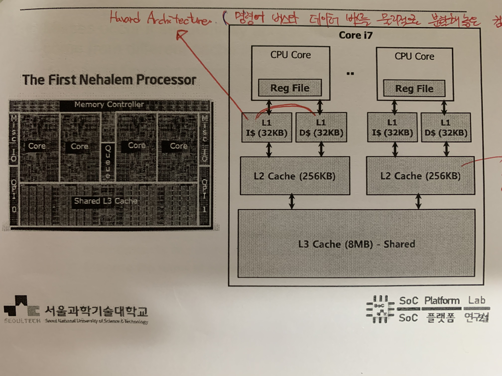
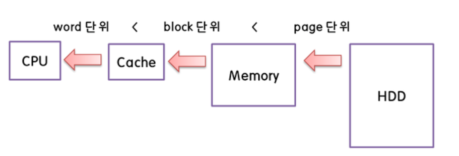

# Cache

> 2020.11.07

## Cache Memory

> 속도가 빠른 장치(CPU)와 느린 장치(Memory)의 속도 차이에 따른 병목 현상을 줄이기 위한 메모리를 말한다.

L1 Cache는 **Instruction Cache와 Data Cache로 나뉘어 있으며 4-8bytes(word)이다.**

L2,L3 Cache는 **L1에 비해 Memory size는 크지만 Access time이 길다.**

#### 메모리 계층

**Register - Cache - Main Memory(DRAM) - Secondary Memory (HDD)**순이다.

용량은 Cache - Main Memory - HDD 순이고, 속도는 역순이다.

**시간지역성** : 한 번 참조된 데이터는 재참조 될 가능성이 크다. 가장 최근에 참조된 데이터를 CPU 가까이에 둔다.

**공간지역성** : 참조된 데이터 주변의 데이터들은 재참조 될 가능성이 크다. 접근된 데이터에 연속적으로 이어져있는 데이터들을 캐시에 같이 저장

#### Who manages data transfer between

- Main Memory - Disks : by Operating System & Programmer
- Registers - Main Memory : by Compiler(Programmer)
- Cache - Main Memory : by hardware(cache controller)

#### Handling Writes

**read miss**가 발생하면 해당 데이터 block을 메인 메모리에서 cache로 가져온다. 

**write miss**가 발생하면 두 가지 옵션이 있다.

- Write-allocate : 캐시로 block을 가져오고, 캐시에 write한다.
- Write no-allocate : 직접 메인메모리에 write하고, 캐시로 blcok을 가져온다.

**When writing**

- Write-back : 캐시에 있는 block의 data만 수정하고, 캐시의 block이 바뀔 때 수정된 데이터를 메인메모리에 write한다.
- Write-through : 캐시와 메인메모리에 모두 write한다.

**Write-allocate & Write-back**이 연관되어 있고, **Write no-allocate & Write-through**가 연관되어 있다.

#### AMAT(Average Memory Access Time)

요구한 데이터가 Cache에 존재하면 이를 **Hit**라고 한다. 이를 확률적으로 표현한 것이 **Hit rate**이고 hit가 발생하기까지 걸린 시간을 **Hit time**이라 한다.

요구한 데이터가 Cache에 존재하지 않을 때를 **Miss**라고 한다. 이 때 프로세스는 처리하고 있던 동작에 Stall을 건 후에 다시 instruction을 수행하는 과정을 거치게 된다. 이 때 걸린 시간을 **Miss Penalty**라고 한다.

위의 것들을 통해 Memory에 Access하는데 걸린 평균시간을 계산할 수 있으며, 이는 Cache의 Performance를 평가하는 척도가 된다. 

**AMAT = (Hit Rate * Hit Time) + (Miss Rate * Miss Penalty)**

#### Reducing Cache Miss Rate

- **Direct mapped cache** 메모리 block과 캐시 block이 1:1로 맵핑된 상태이다. 데이터가 저장된 Address bits 일부분을 block address로 사용하여 캐시 block에 맵핑하여 저장한다. 각각의 Memory block들이 저장될 cache block들이 이미 정해져 있어 캐시에 저장되는 속도가 빠르지만, 그만큼 충돌이 잦다.
- **Fully associative cache** : 메모리 block이 캐시의 어느 block이던지 자유롭게 맵핑될 수 있다. 메모리 block이 캐시의 빈 block에 저장되기 때문에 충돌이 잦지는 않지만, 모든 way를 탐색해야 하기 때문에 시간이 오래 걸린다.
- **n-way set associative cache** : 캐시 block이  n개의 set으로 나뉘어져 있으며, 메모리 block은 특정 set에 맵핑될 수 있고 set내부에서는 어느 way에나 위치할 수 있다. 

**Direct mapped cache와 Fully associative cache는 장단점이 너무 극단적이기 때문에 n-way set associative cache를 주로 사용한다.**

#### Replacement Policy

> Miss가 발생했을 때, 어떤 way의 block을 대체할지 선택하기 위한 정책이다.

- Direct mapped cache는 1:1 맵핑이기 때문에 다른 선택이 없다.
- n-way set associative cache는 우선 할당되지 않은 블락(non-valid) block을 우선으로 선택하고, 그렇지 않으면 **LRU** or **Random**의 방식을 사용하여 대체할 block을 선택한다.
  1. LRU(Least-recently used) : 가장 오랫동안 사용되지 않은 것을 택하는 방법
  2. Random : 말그대로 랜덤으로 택하는 방법

#### Reducing Cache Miss Penalty

- 캐시의 여러 레벨(L1,L2,L3)을 사용한다.
  - CPU와 붙어있는 L1 cache는 가장 메모리 사이즈가 작지만 빠르다.
  - L1에서 Miss가 발생하면 L2 Cache를 탐색하며, L1보다는 사이즈가 크지만 속도가 느리다.(메인메모리보다는 빠르다.)
  - L2에서도 Miss가 발생하면 L3 Cache를 탐색하며, L1,L2 보다는 사이즈가 크지만 이 또한 속도가 느리다.(메인메모리보다는 빠르다.)
  - L3에서마저 Miss가 발생하면 메인메모리에 접근한다.

**L1은 Hit time을 줄이는데에만 목적**을 두기 때문에 **size는 작다.** **L2,L3는 L1에서 Miss 발생 시 메인 메모리에 접근하는 것을 막기 위함이므로 Hit time보다는 Miss rate에 중점을 둔다**. 그러므로 **L2,L3는 size가 크다.**

**[참고]**

- https://ssoonidev.tistory.com/35
- https://github.com/gyoogle/tech-interview-for-developer/blob/master/Computer%20Science/Computer%20Architecture/%EC%BA%90%EC%8B%9C%20%EB%A9%94%EB%AA%A8%EB%A6%AC(Cache%20Memory).md
- https://jins-dev.tistory.com/entry/Cache-%EC%97%90-%EB%8C%80%ED%95%9C-%EC%9D%B4%EB%A1%A0%EC%A0%81%EC%9D%B8-%EC%A0%95%EB%A6%AC
- 서울과학기술대학교 전자IT미디어공학과 컴퓨터구조 수업자료

