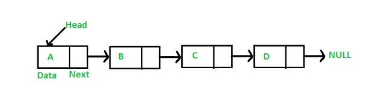

# Linked List

> 연속적인 메모리 위치에 저장되지 않는 선형 데이터 구조로, 각 노드는 데이터 필드와 다음 노드에 대한 참조를 포함하는 노드로 구성되어 있다.




#### Linked List를 사용하는 이유

- 배열은 선형 데이터를 사용하는데 유용하게 쓰이지만, 배열의 크기가 고정되어 있어 미리 임의의 크기만큼 할당이 되어 있어야 한다. 


**장점**

1. 동적 크기 할당
2. 삽입/삭제 용이


**단점**

1. 특정 인덱스 혹은 데이터로의 직접적인 접근이 불가능하다. 첫 번째 노드부터 순차적으로 탐색해야 한다. 그러므로 이진탐색을 할 수 없다.
2. 각 노드에 데이터 이외에 다음 요소의 주소를 가리킬 추가적인 메모리가 필요하다.


#### 구현

- 리스트에 추가될 데이터 노드

```python
class Node():
    def __init__(self,data):
        self.data=data
        self.next=None
    def __str__(self):
        return (self.data,self.next)
```

- 링크드리스트

```python
class linkedList():
    def __init__(self):
        self.head=None

    def append(self,node):
        if self.head==None:
            self.head=node
        else:
            curr=self.head
            while curr.next!=None:
                curr=curr.next
            curr.next=node

    def getDataIndex(self,data):
        cur=self.head
        idx=0
        while cur:
            if cur.data==data:
                return idx
            cur=cur.next
            idx+=1
        return -1

    def insertNodeAtIndex(self,idx,node):
        curr=self.head
        curr_idx=0
        prev=None
        if idx==0:
            if self.head:
                next_node=self.head
                self.head=node
                self.head.next=next_node
            else:
                self.head=node
        else:
            while curr_idx!=idx:
                if curr:
                    prev=curr
                    curr=curr.next
                else:
                    break
                curr_idx+=1
            if curr_idx==idx:
                prev.next=node
                node.next=curr
            else:
                return -1

    def insertNodeAtData(self,data,node):
        curr=self.head
        while curr:
            if curr.data==data:
                node.next=curr.next
                curr.next=node.next
            else:
                curr=curr.next
        return -1

    def deleteAtIdx(self,idx):
        curr=self.head
        prev=None
        curr_idx=0
        if idx==0:
            self.head=self.head.next
        else:
            while curr:
                if curr_idx==idx:
                    prev.next=curr.next
                    break
                prev=curr
                curr=curr.next
                curr_idx+=1
        if curr_idx!=idx:
            return -1

    def clear(self):
        self.head=None

    def print_list(self):
        curr=self.head
        list_str=''
        while curr:
            list_str+=str(curr.data)
            if curr.next:
                list_str+=' ->'
            curr=curr.next
        print(list_str)

l1=linkedList()
l1.append(Node(1))
l1.append(Node(2))
l1.append(Node(3))
l1.append(Node(5))
l1.print_list()
l1.insertNodeAtIndex(3,Node(4))
l1.print_list()
l1.insertNodeAtIndex(0,Node(0))
l1.print_list()
l1.deleteAtIdx(0)
l1.print_list()
l1.deleteAtIdx(2)
l1.print_list()
```


**[참고]**

- https://gyoogle.dev/blog/computer-science/data-structure/Linked%20List.html
- https://daimhada.tistory.com/72