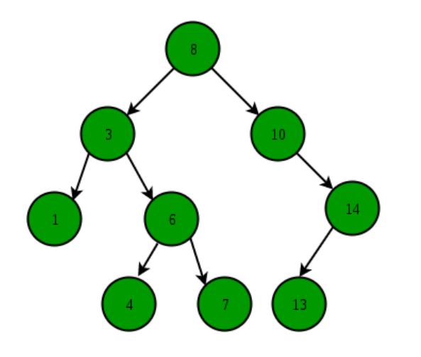

# BinaryTree

> 2020.11.15

#### 이진트리

- 이진트리는 각 노드의 자식이 2개 이하여야 한다.
- 모든 레벨이 꽉 찬 이진 트리를 **포화이진트리**라고 한다. 위에서 아래로, 왼쪽에서 오른쪽으로 순서대로 채워진 이진트리를 **완전이진트리**라고 한다. 모든 노드가 0개 혹은 2개의 자식 노드만을 갖는 이진 트리를 **정이진트리**라고 한다.

 

#### Binary Search Tree(BST)

> 이진탐색과 연결리스트를 합친 자료구조로, 연결리스트는 데이터의 삽입과 삭제 시 O(1)의 시간복잡도를 가져서 장점이 있었지만, 데이터를 탐색하는데 O(N)의 시간복잡도를 가지는 것이 단점이었다. 여기에 이진탐색을 사용하여 탐색할 때의 시간복잡도를 O(logN)으로 하여 데이터의 삽입/삭제와 탐색까지 효율적으로 만든 자료구조이다.

- 이진 트리의 일종이지만, 데이터를 저장하는 규칙이 존재하며, 그 규칙은 특정 데이터를 찾는데 사용할 수 있다.

  1. 이진 탐색 트리의 노드에 저장된 키는 유일하다.
  2. 부모의 키가 왼쪽 자식 노드의 키보다 크다.
  3. 부모의 키가 오른쪽 자식 노드의 키보다 작다.
  4. 왼쪽과 오른쪽 서브트리도 이진 탐색 트리이다.

  