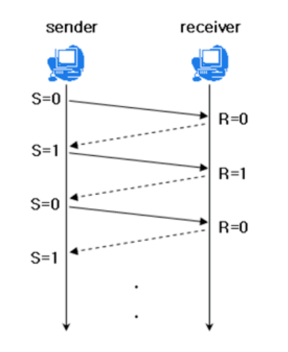
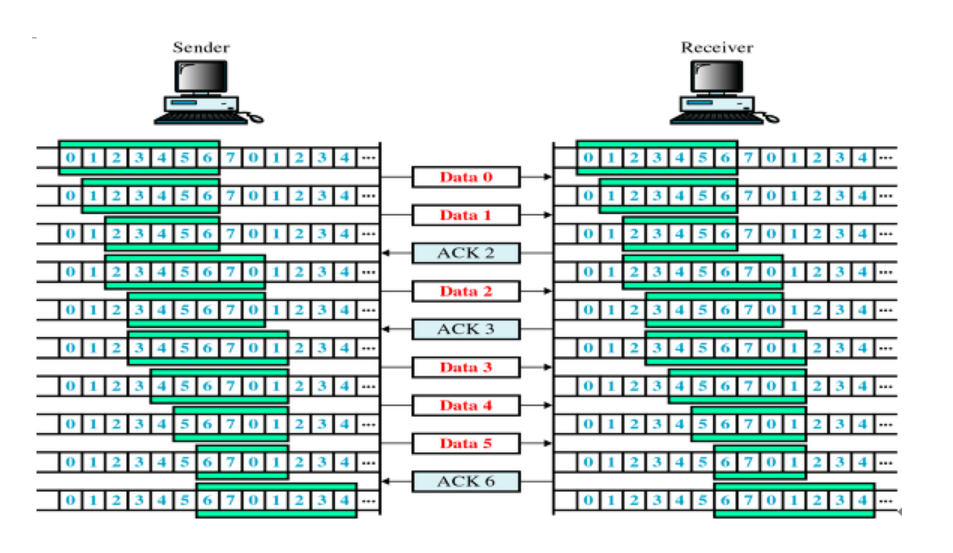

# TCP/IP (흐름제어/혼잡제어)

> 2020.11.11

#### TCP 통신이란?

- 네트워크 통신에서 신뢰적인 연결방식
- TCP는 기본적으로 unreliable network에서, reliable network를 보장할 수 있도록 하는 프로토콜
- TCP는 network congestion avoidance alogorithm을 사용

#### Reliable network를 보장한다는 것은 4가지 문제점 존재

- 손실 : packet이 손실될 수 있는 문제
- 순서 바뀜 : packet의 순서가 바뀌는 문제
- Congestion : 네트워크가 혼잡한 문제
- Overload : receiver가 overload 되는 문제

:memo:**Packet 이란? 인터넷 내에서 데이터를 보내기 위한 경로배정(라우팅)을 효율적으로 하기 위해서 데이터를 여러 개의 조각들로 나누어 전송하는데 이 조각을 패킷이라고 한다. 컴퓨터 네트워크가 전달하는 형식화된 데이터 블록으로 제어정보와 데이터로 구성되어 있으며, 페이로드로도 불림.**

#### 흐름제어와 혼잡제어

- 흐름제어 : receiver가 server에게 현재 자신의 상태를 feedback 하는 것으로, 송신측과 수신측의 데이터 처리 속도를 해결하기 위함.

  - 송신속도가 수신속도보다 빠를 때, 수신 데이터의 저장 용량이 초과하여 데이터 손실이 발생하고 그로인해 무의미한 응답과 데이터 전송이 발생한다.

  - Solution : 송신 속도를 수신 속도에 맞추기

    - Stop & Wait : 전송한 패킷에 대해 ACK를 받아야만 다음 데이터 전송

      

    - Sliding window : 수신측에서 윈도우의 크기 설정하고 윈도우에 포함되는 패킷을 전송한다. 패킷 전달 확인되는대로 윈도우 옆으로 옮겨 다음 패킷 전송

      

- 혼잡제어 : 송신측의 데이터 전달과 네트워크의 데이터 처리의 속도차이를 해결하기 위함.

  - 송신 데이터는 대형 네트워크를 통해 전달한다. 만약, 한 라우터에 몰리면 모든 데이터를 처리할 수 없게 되어 다른 곳으로 데이터를 전송한다. 그로 인해 혼잡도만 높아지거나, Overflow가 발생한다. Network Congestion을 줄이기 위해 데이터 전송속도를 강제로 줄인다.

  - Solution

    - AIMD(Additive Increase / Multicative Decrease) : 패킷을 하나 보내고 전송이 실패하거나 일정시간이 지나지 않으면 window size를 1 증가시키는 방식. 만약 여러 호스트가 한 네트워크를 공유하고 있으면 나중에 진입하는 호스트는 불리하다. 하지만, 나중에 평형상태로 수렴한다. (초기 높은 대역폭을 사용할 수 없고, 문제가 생겨야만 대역폭을 줄이기 때문에 문제 상황을 미리 감지하지 못하는 것이 단점이다.)

    - Slow Start : AIMD와 비슷하기는 하지만, 전송속도를 올리는 측면에서 차이가 크다. 패킷을 하나 보내고, 수신이 성공하면 각각의 ACK 패킷마다 window size를 1씩 늘린다. 즉 window size가 지수적으로 증가하게 된다. 증가하다가 혼잡현상이 발생하게 되면 window size를 1로 초기화한다. 처음에는 네트워크의 수용량을 알 수 없지만, 한 번 혼잡현상이 발생하면 예상이 가능하다. 혼잡현상 발생하기 전까지는 지수적으로 증가하다가, 그 이후 1씩 증가시킨다.

    - Fast Recovery : 혼잡상태가 되면 Window size를 1로 줄이지 않고 반으로 줄이고 선형 증가시키는 방법이다. 빠른 회복 정책까지 적용하면 혼잡 상황을 한 번 겪고 나서 부터는 순수한 합 증가/곱 감소 방식으로 동작하게 된다.

      

**[참고]**

- https://mangkyu.tistory.com/15
- https://jwprogramming.tistory.com/36

- https://gyoogle.dev/blog/computer-science/network/%ED%9D%90%EB%A6%84%EC%A0%9C%EC%96%B4%20&%20%ED%98%BC%EC%9E%A1%EC%A0%9C%EC%96%B4.html