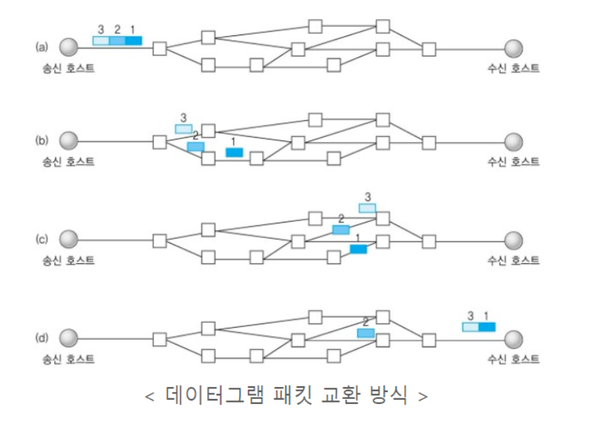
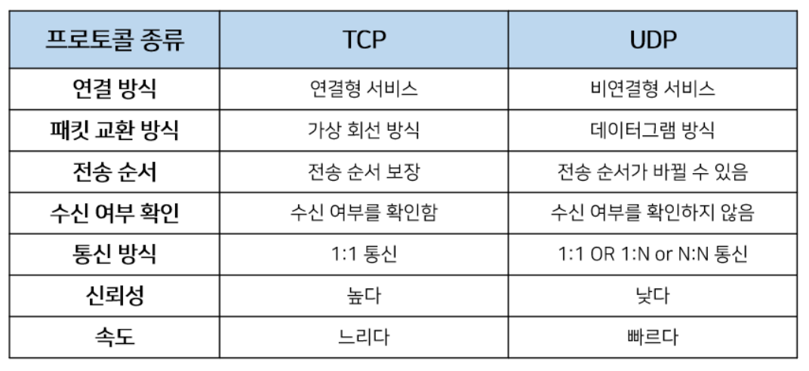

# TCP&UDP

> 2020.11.11

#### UDP(User Data Protocol)

> 데이터그램 단위로 데이터를 처리하는 프로토콜

- 비연결형 방식 : 많은 경로 중 특정 경로를 할당하지 않고, 각각의 패킷을 독립적으로 처리한다.
- 송/수신 신호절차가 없다.(3/4 Way Handshake)
- 신뢰성이 없다.
  - 신뢰성보다는 연속성이 중요한 스트리밍 같은 서비스에 사용된다.
- 각각의 패킷이 독립적으로 처리되므로 속도가 빠르다.
  - 서로 다른 경로로 독립적으로 처리하지만, 패킷에 번호부여, 흐름제어, 혼잡제어가 없어 속도가 빠르다.
- UDP 헤더의 checksum 필드를 통해 최소한의 오류만 검출한다.
- UDP에는 연결이 없어서(connect함수 불필요) 서버, 클라이언트 소켓 구분이 없다.
- 1:1, 1:N, N:M 연결이 가능하다.

#### Nagle Algorithm

- 조금씩 여러 번 보내지 않고, 가능하면 한 번에 많이 보낸다는 생각에 착안된 방법이다.
- 장점 : 같은 데이터이더라도 한 번에 많은 데이터를 보내기 때문에 데이터 전송횟수가 줄어들어 네트워크 효율성이 높아짐.
- 단점 : ACK를 받을 때까지 남은 데이터를 보내지 않고, 버퍼에 저장해두기 때문에 속도가 느리다.

#### SubnetMask

- 0.0.0.0 ~ 255.255.255.255까지의 IP를 같은 대역대인지 다른 대역대인지 구분하기 위한 것.

- 192.168.10.1/24라는 IP가 있다고 가정하자.

  24는 **Prefix**라 하고, 서브넷 마스크의 1의 개수라고 봐도 무방하다. 즉 11111111.11111111.11111111.00000000 = 255.255.255.0(subnet mask)를 뜻한다.

  1을 고정(네트워크 주소), 0을 자유(호스트 주소)라고 칭한다.

  11000000.10101000.00001010.00000001 (192.168.10.1) << IP주소

  11111111.11111111.11111111.00000000 << Subnet mask

  --------------------------------------------------------------------------------------------------- AND 시키면

  11000000.10101000.00001010.00000000 이렇게 나타낼 수 있다.

  

  즉, 192.168.10.1/24라는 IP와 같은 대역대는 192.168.10.0 ~ 192.168.10.255에 해당하는 IP라고 할 수 있고, 이 범위 내의 IP를 가지는 컴퓨터끼리는 서로 통신할 수 있다는 뜻이다.

  

**[참고]**

- https://mangkyu.tistory.com/15