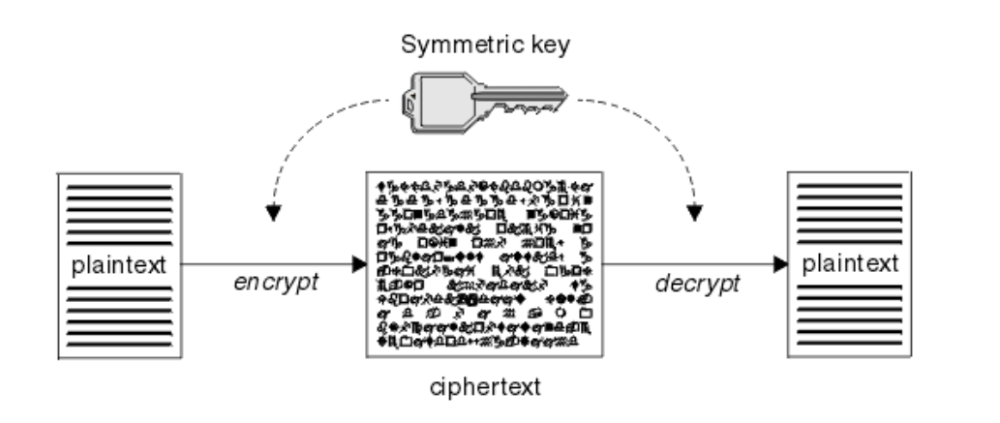
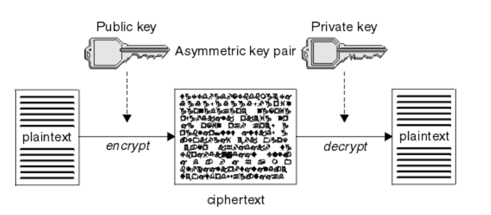

# 대칭키와 공개키

> 2020.11.13

#### 대칭키

> 대칭키 암호화 방식은 암호화와 복호화에 같은 암호키(대칭키)를 사용하는 암호화 알고리즘이다. 공개키 암호화 방식에 비해 암호화/복호화가 빠르다는 장점이 있지만, 암호화 통신을 하는 사용자끼리 같은 대칭키를 공유해야 한다는 단점이 있다.

- 대칭키 암호화 방식은 암호화와 복호화가 비교적 간편하다. 

- 대칭키를 사용자끼리 물리적으로 만나서 전달하지 않는한, 대칭키를 전달하는 과정에서 해킹의 위험에 노출될 수 있다.

1. A가 B의 공개키로 암호화 통신에 사용할 대칭키를 암호화하여 B에게 보낸다.
2. B는 암호문을 받아, 자신의 비밀키로 복호화한다.
3. B는 A로부터 얻은 대칭키로 A에게 보낼 평문을 암호화하여 A에게 보낸다.
4. A는 자신의 대칭키로 암호문을 복호화한다.
5. 대칭키로 암호화 통신을 한다.

#### 공개키

> 공개키 암호화 방식은, 암호화와 복호화에 사용하는 함호키를 분리한 방식이다.

1. 사이트(특히 전자상거래 기관)은 인증기관에 자신의 정보와 공개키를 제출한다.
2. 인증기관은 정보를 면밀히 검토한 뒤, 사이트의 정보와 공개키를 자신의 비밀키로 암호화한다.
3. 인증기관은 인증기관의 비밀키로 암호화된 사이트의 정보와 공개키를 사이트에 송신한다.
4. 개인이 브라우저를 통해 사이트에 접속하면, 암호화된 사이트의 정보와 공개키를 사이트로부터 받는다.
5. 브라우저는 인증기관의 공개키(이 공개키는 브라우저에게만 제공된다.)로 이를 복호화하여 사이트의 공개키를 얻는다.
6. 브라우저가 대칭키를 사이트의 공개키로 암호화하여 사이트에 보낸다.
7. 사이트는 자신의 개인키로 암호화된 대칭키를 복호화한다.
8. 이제 개인과 사이트는 대칭키로 통신할 수 있다.

**[참고]**

- https://preamtree.tistory.com/38