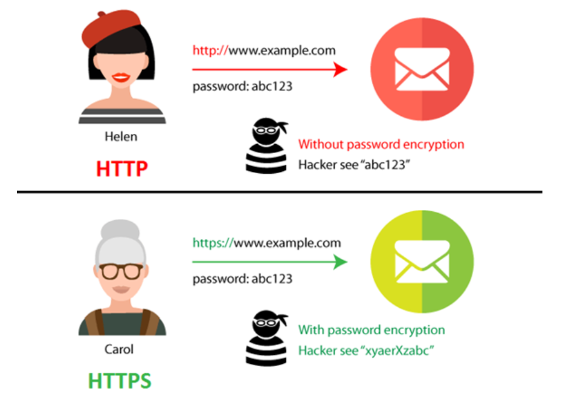

# HTTP와 HTTPS

> 2020.11.13

#### HTTP(Hyper Text Transfer Protocol)

- 서로 다른 시스템 사이에서 통신을 주고 받게 해주는 가장 기초적인 프로토콜이다. 서버에서 브라우저로 데이터를 전송해주는 용도로 사용된다.

#### HTTPS(Hyper Text Transfer Protocol Secure)

- 일반 HTTP 프로토콜의 문제점은 서버에서부터 브라우저로 전송되는 정보가 암호화되지 않는 것이다. HTTPS 프로토콜은 **SSL(보안 소켓 계층)**을 사용함으로써 이 문제를 해결했다.

**SSL은 서버와 브라우저 사이에 안전하게 암호화된 연결을 만들 수 있도록 도와주고, 서버와 브라우저가 민감한 정보를 주고받을 때 도난당하는 것을 막아준다.**

SSL 인증서는 사용자가 사이트에 제공하는 정보를 암호화하는데, **쉽게 말해서 데이터를 암호로 바꾸는 것이다.** 이렇게 전송된 데이터는 **암호화 되어있기 때문에 해독할 수 없게 된다.** 이 외에도 **HTTPS는 TLS(전송 계층 보안) 프로토콜을 통해서도 보안을 유지한다.** 

**TLS는 데이터 무결성을 제공하기 때문에 데이터가 전송 중에 수정되거나 손상되는 것을 방지하고, 사용자가 자신이 의도하는 웹 사이트와 통신하고 있음을 입증하는 인증 기능도 제공하고 있다.**

**HTTPS로 전환하게 되면 검색엔진 최적화에 있어서도 우위에 있다.**