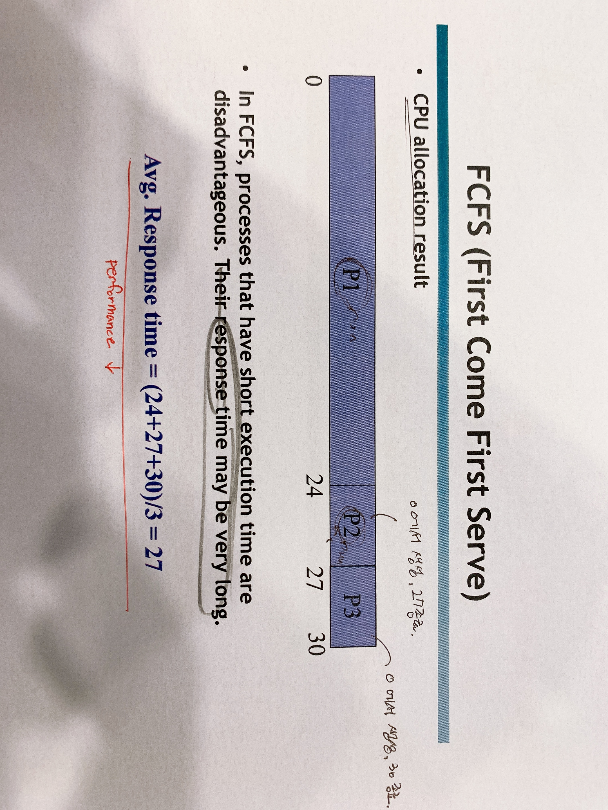
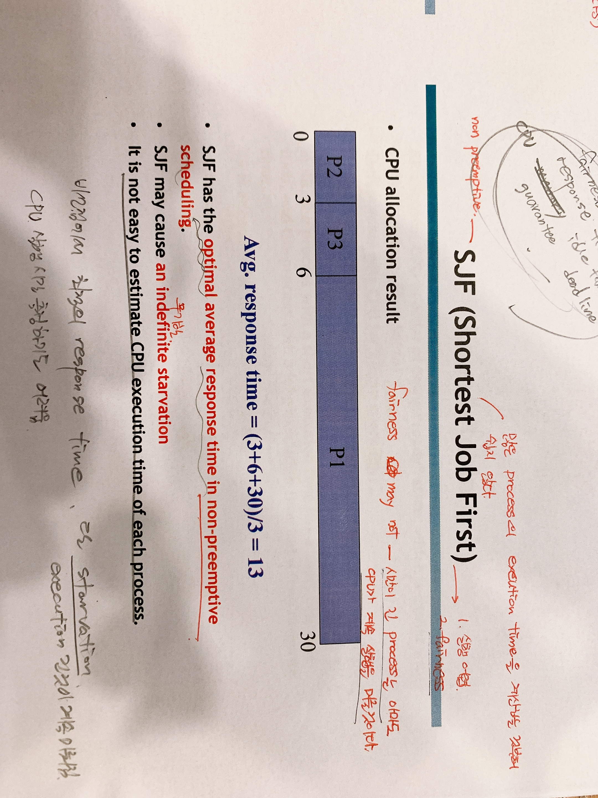
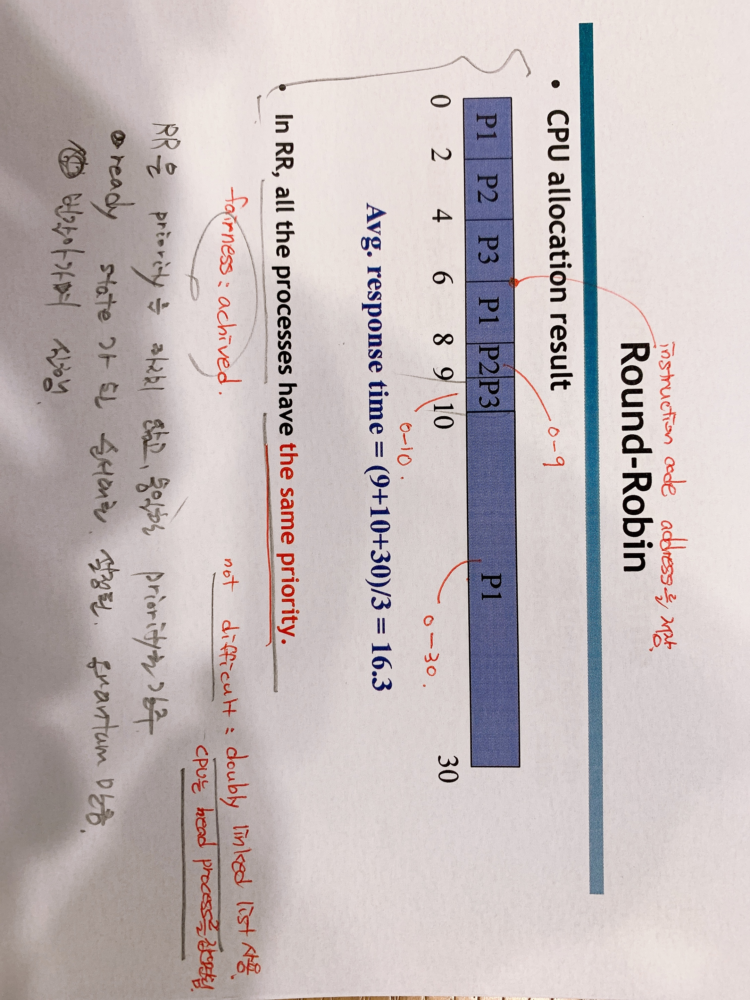

[TOC]

# CPU Scheduling & Context Switch

> 2020.10.21

## 1. CPU Scheduling

> CPU Scheduling이란 어느 프로세스에 CPU를 할당할 것인지, 얼마나 할당할 것인지 관리하는 시스템이다.

### 1.1 CPU Scheduling Goal

- Fairness
  - Indefinite starvation 없이 모든 프로세스가 실행되어야 한다.
- Response Time
  - 프로세스 생성부터 종료까지 평균 응답시간이 짧아야 한다.
- Minimize CPU idle time
  - CPU는 한정되어 있는 자원이기 때문에, CPU가 아무것도 하지 않는 시간을 최소화해야 한다.
- Guarantee deadline
  -  Real-time system을 위해 deadline을 지켜야 한다.

### 1.2 Preemption vs Non-preemption

- Preemption(선점) : 어느 때나 CPU가 다른 프로세스들에 의해 회수당하는 경우
- Non-preemption(비선점) : 한 프로세스가 CPU를 할당받으면 release하기 전까지는 다른 프로세스들에 의해 CPU를 회수당하지 않는다.

### 1.3 Non-Preemptive Scheduling

- FCFS(First Come First Serve) : 가장 먼저 ready list를 참조하여 head에서부터 순서대로 CPU를 할당하며 작업을 처리하는 방식이다.
  - 
  - P1,P2,P3가 0초에 ready state로 된 경우, FCFS
    - P1이 먼저 실행되고, 이후에 P2, P3가 순차적으로 실행된다.
    - FCFS 방식에 의하면, 실행시간이 짧은 프로세스들은 응답시간이 매우 길어질 수 있다.

- SJF(Shortest Job First) : 실행시간이 짧은 프로세스를 우선적으로 실행하는 방식이다.
  - 
  - P1,P2,P3가 0초에 ready state로 된 경우, SJF
    - 실행시간이 짧은 P2,P3가 먼저 실행되고, 그 다음 P1이 실행된다.
    - SJF는 비선점 스케쥴링에서 이상적인 평균 응답시간을 갖는다. 하지만, 실행시간이 긴 프로세스는 CPU가 실행을 계속 미루어, `An indefinite starvation`을 야기할 수 있다.
    - 또한, 각각의 프로세스들의 실행시간을 측정하는 것도 쉽지 않다.

### 1.4 Preemptive Scheduling

- Round-Robin : 라운드로빈 스케쥴링은 FCFS와 비슷하지만, 각각의 프로세스는 동일한 양만큼의 시간동안만 CPU를 할당받는다. 주어진 시간이 끝나면 프로세스의 종료여부와 관계없이 CPU는 다른 프로세스에 할당된다(Context Switch).
  - 
  - P1,P2,P3가 0초에 ready state로 된 경우, RR(time quantum=2)
    - 라운드로빈 스케쥴링은 프로세스들의 우선순위를 따지지 않고 ready state가 된 순서대로 설정된 time quantum만큼 번갈아가며 프로세스들을 실행한다.
    - Time Quantum이 크면 FCFS와 같게 되고, 작다면 Context Switch가 잦아져서 오버헤드가 증가한다.

- Priority-based scheduling: 프로세스는 각각 다른 우선순위를 가질 것이기 때문에 CPU는 높은 우선순위를 갖는 프로세스에 먼저 할당되어야 한다.

  

  - Static priority : 프로세스의 우선순위가 바뀔 수 없으며, 정해진 우선순위대로 동작하는 스케쥴링 방식이다. 
    - 우선순위가 높은 프로세스가 많다면 낮은 우선순위를 갖는 프로세스는 오래동안 실행될 수 없어 `indefinite starvation`을 야기할 수 있다.

  

  - Dynamic prioriry : Static prioriry와는 반대로 프로세스의 우선순위가 바뀔 수 있다.
    - 오랫동안 실행되지 못한 프로세스의 우선순위를 높게 재설정하여 `indefinite starvation`을 막을 수 있다.
    - 하지만, 각 프로세스의 우선순위를 어떻게 재설정할지는 system designer의 과제이다.

### 1.5 Minimize CPU idle time

- 모든 스케쥴링 정책에서 이벤트를 기다리는 프로세스들은 자동으로 CPU를 release하고, block state로 된다.
- 오직 ready state인 프로세스만 CPU를 할당받을 수 있다.

## 2. Context switch

> CPU가 한 프로세스를 할당하고 있을 때, 다른 프로세스로 바꿔 할당하는 것.

### 2.1 Context switch

- **What should be done during context switch?** : 운영체제는 이전에 실행했던 프로세스의 context를 저장하고, 새로이 실행할 프로세스의 context를 불러와야 한다.

- Context : CPU register values(PC,SP,PSW, general purpose regiseters)로 간단하게 프로세스가 실행해야 하는 위치를 기억하고 있는 register로 생각하면 된다.
- Context-switch time은 overhead이다. Context-switch가 일어나는 동안 시스템은 아무것도 하지 않기 때문에, switching이 많으면 많을수록 `CPU idle time`이 늘어난다. 그렇기 때문에 system designer는 이를 고려하여야 한다.
  - too frequent context switch => performance degradation

