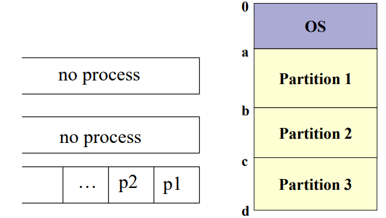
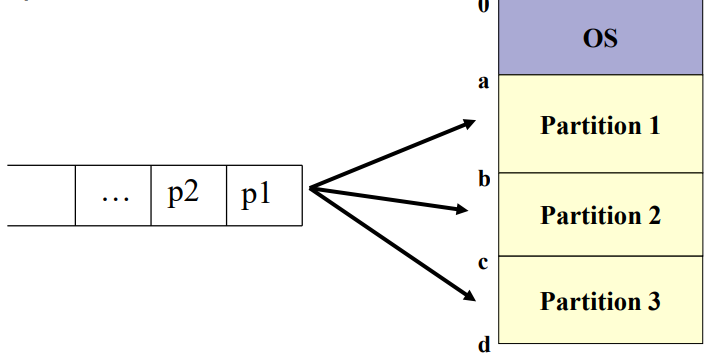
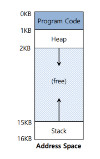
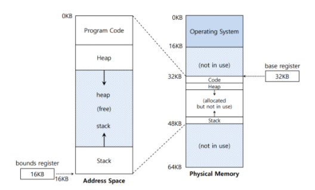
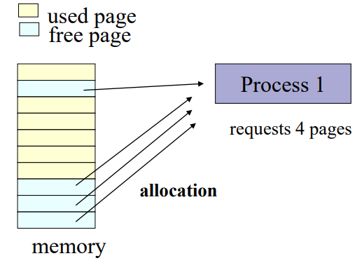
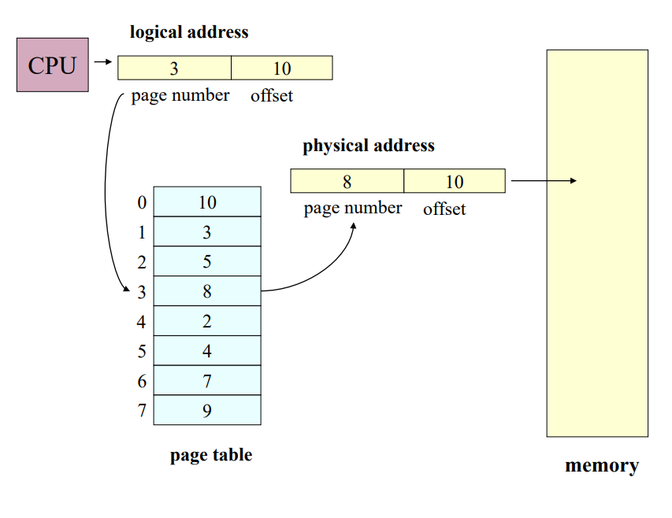
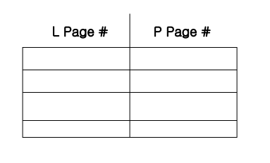

[TOC]

# Memory Management

> 2020.10.27

## 1. Memory Management

> 프로세스가 실행되면 메모리가 프로세스에 할당된다. 멀티프로세스에서는 각 프로세스 별로 메모리 차지 경쟁이 생기는데 어떤 프로세스에 메모리 공간을 할당할 것인지 효율적으로 관리하는 시스템이 **Memory Management**이다.

## 2. Contiguous Memory Allocation Policy

> Static partitioning + Static allocation/Dynamic allocation
>
> Dynamic partitioning + Best-fit/First-fit/Worst-fit

### 2.1 Static Partitioning + Static Allocation

- 메모리가 고정된 사이즈로 나뉘어 있으며, 각 프로세스들은 정해진 메모리 공간에 할당된다. 

- 문제점 : 다른 파티션이 비어있음에도 불구하고, 정해진 파티션만 사용하려 대기하는 상황이 벌어지게 된다. 즉, 메모리 낭비가 발생하게 된다.

### 2.2 Static Partitioning + Dynamic Allocation

- 메모리가 고정된 사이즈로 나뉘어 있으며, 각 프로세스들은 사용가능한 메모리에 동적으로 할당된다. 동적으로 할당되기 때문에 Static Allocation과 같은 메모리 낭비는 발생하지 않는다.

/

### 2.3 Disadvantages of StaticPartitioning

- StaticPartitioning은 기본적으로 메모리가 **fixed size**로 고정되어 있기 때문에 프로세스가 실제로 사용하는 메모리량과는 무관하게 메모리가 쓰인다. 만약 **프로세스가 사용하는 메모리량**이 **fixed size**보다 작다면 **메모리 낭비(Internal Fragmentation)**가 생길 것이다.

### 2.4 Dynamic Partitioning

- 요청된 사이즈만큼의 메모리가 프로세스에 할당된다. 즉, 프로세스가 사용하는 메모리량만큼 할당된다.
- 하지만, 프로세스의 생성/종료가 반복됨에 따라 **External Fragmentation(메모리낭비)**가 발생한다.
  1. 메모리를 할당받은 프로세스가 종료되면 사용하던 메모리를 반납하고, 해당 메모리는 Hole이 된다.
  2. 새로운 프로세스가 생성되어 Hole 메모리를 할당받는다.
  3. 새로이 생성된 프로세스가 Hole보다 작은 메모리를 요구한다면, 분할된 Hole이 그대로 남아있게 된다.
  4. 분할된 Hole이 생성될 프로세스의 메모리 요구량 보다 작다면, 그 Hole은 쓰이지 않는다.

- 위와 같이 프로세스를 할당할 수 없을 정도의 Hole이 발생하면 그 만큼의 **메모리 낭비(External Fragmentation)**가 생길 것이다.

- 해결법
  - Hole Coalescing : 인접한 hole들을 모아 hole을 크게 만들어 External Fragmentation을 완화시킬 수 있다. 하지만 한계가 있다.
- ProcessAllocation Policy
  - Best-fit : 메모리 크기면에서 실행될 프로세스와 가장 적합한 홀을 할당한다.
  - First-fit : 첫 번째 홀을 할당한다.
  - Worst-fit : 가장 큰 홀을 할당한다.

### 2.5 Problems of Contiguous Allocation

- **Internal Fragmentation**과 **External Fragmentation**이 발생하여 메모리가 낭비된다.
- 사용가능한 메모리 파티션보다 프로세스가 사용할 용량이 크면 안된다.

## 3. Memory Virtualization

> 운영체제는 각각의 프로세스가 메모리 전체를 사용한다는 가상의 메모리 공간을 제공해야 한다.
>
> 가상 주소 공간을 통해 개발자들은 메모리 주소가 연속되어 있다는 가정 하에 프로그래밍 할 수 있다.
>
> 더불어 실제 물리적 주소를 숨김으로써 프로세스와 운영체제를 보호할 수 있다.

### 3.1 Virtual Address Space

- 가상 주소 공간은 크게 세 가지 영역으로 구성되어 있다. 프로그램의 명령어를 저장하는 Code영역, 동적 메모리 할당을 위한 heap영역, 지역변수와 매개변수 등의 저장을 위한 Stack영역이다. 이 때 Heap과 Stack 사이에 사용하지 않는 빈 공간은 Heap이나 Stack이 모자랄 경우 확장하여 사용한다.

 

### 3.2 Logical Address & Physical Address

- Logical Address
  - EXE file에서의 주소이며, CPU에 의해 사용되어진다.
  - Virtual Address로 알려져있다.

- Physical Address
  - 물리적 메모리의 주소이다.

### 3.3 Address Translation

- 위에서 언급했듯이, 운영체제는 가상의 메모리 주소를 제공한다. 하지만 이를 통해 실제 메모리에 접근하려면 가상 메모리를 물리적 메모리로 변환해야한다. 이를 **Address Translation**이라 한다.

  

- Physical Address = Logical Address + base

  - 물리적 주소는 가상 주소에 base 값을 더하여 반환한다.

- 0 <= Logical Address <= bounds

  - 할당받은 주소공간은 bound값까지만 사용할 수 있다.

- Static Allocation : 프로세스가 할당되는 메모리 파티션이 고정되어 있어 논리적 주소와 물리적 주소가 같을 수 있다.
- Dynamic Allocation : 프로세스의 물리적 주소가 시스템 상태에 따라 달라진다.

## 4. Noncontiguous Memory Allocation

> paging system
>
> segmentation system
>
> segmentation-paging system

### 4.1 paging system

- 메모리가 고정된 크기로 나뉘어있으며, 메모리는 페이지로 할당한다. (ex. page size : 4KB)

- 만약 프로세스가 16KB를 요청한다면, 4개의 페이지를 할당하면 된다.

  

- 페이지는 위의 그림과 같이 physical memory가 **Noncontiguous**일 수 있다.

### 4.2 Address Translation

- 각 프로세스는 Logical page number와 physical page number와 대응하는 페이지 테이블을 갖고 있다.

- CPU는 현재 실행되고 있는 프로세스의 페이지 테이블의 논리적 주소를 사용하여 물리적 주소를 계산한다.

  

### 4.3 Page Table

- 페이지 테이블은 메인메모리에 존재한다.
- PTBR(Page-table base register)는 페이지 테이블의 시작 주소를 가리키며, PRLR(Page-table length register)는 페이지 테이블의 크기를 나타낸다.
- 모든 데이터와 명령(instruction) access는 페이지 테이블과 데이터와 명령(instruction) 각각 한 번씩, 총 두 번 메모리에 접근해야한다.
- 이는 TLB(Translation look-aside buffer)라 불리는 하드웨어 캐시의 사용으로 해결할 수 있다.

### 4.4 TLB

- TLB에 L이 있으면 P를 꺼내오고 그렇지 않으면 메모리의 페이지 테이블에서 P를 가져온다.

  

### 4.5 Hierarchical Page Tables

- 페이지 테이블이 계층 구조를 갖는 것으로, 일반적으로 two-level-page table이 있다.
- 이는 페이지 테이블을 페이지화 하여 하드 디스크에 저장해두고 있다가 필요시 메모리로 로드하는 방식이다. 이러면 Logical Address는 p1,p2,d 방식으로 나눈다.

**[참고]**

- https://ju-hy.tistory.com/11
- https://m.blog.naver.com/PostView.nhn?blogId=and_lamyland&logNo=221292962688&proxyReferer=https:%2F%2Fwww.google.com%2F