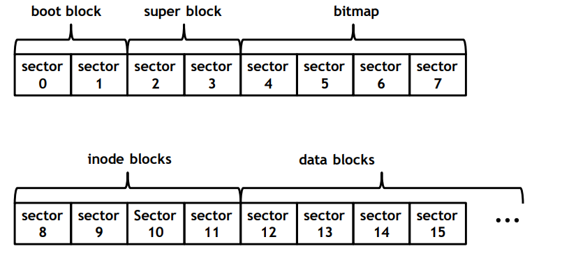
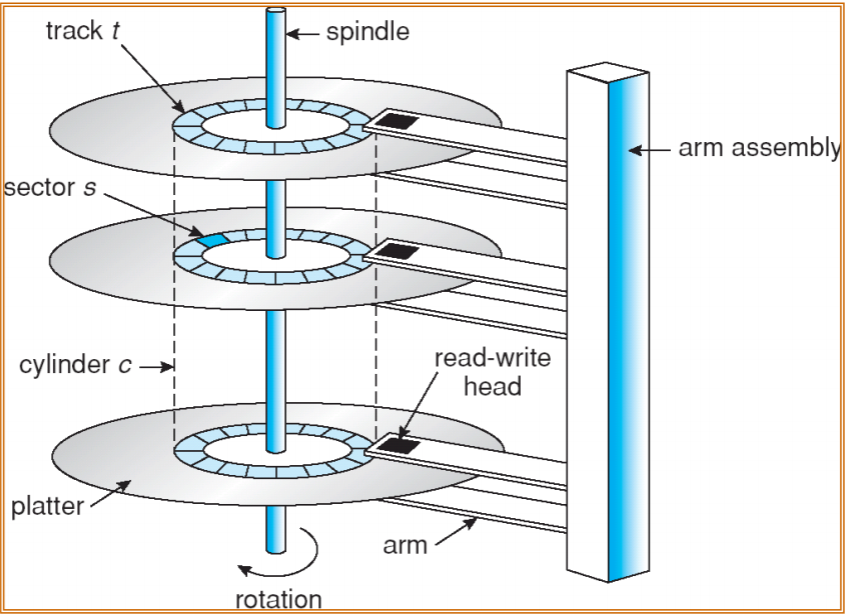
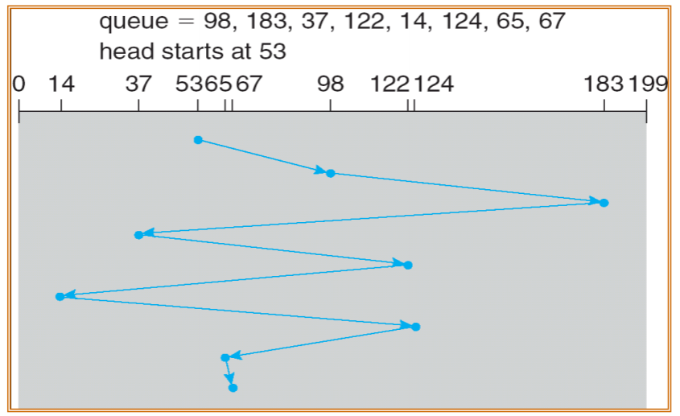
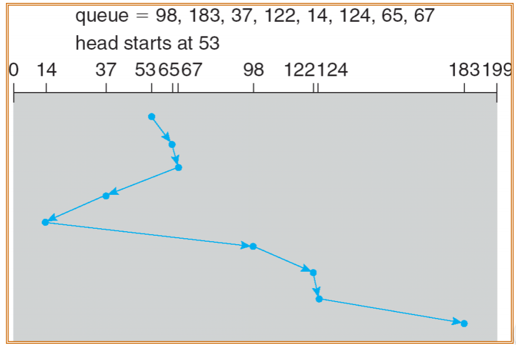
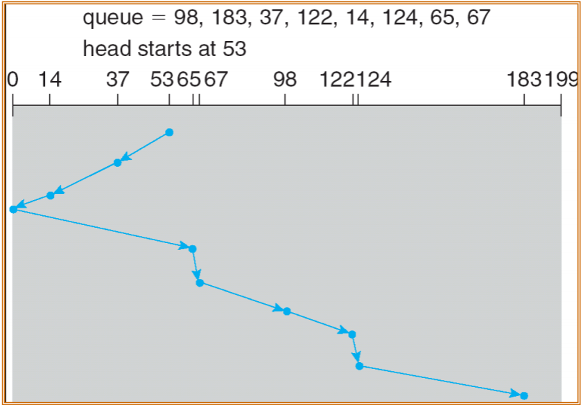
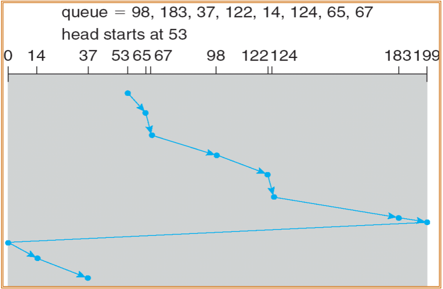

# File System

> 2020.10.27

## 1. File System

> 정의 : 디스크에서 파일 저장 및 검색을 담당하는 OS 모듈이다.
>
> 기능 : 파일과 관련된 API를 제공한다. 파일 무결성(데이터베이스에 저장된 데이터의 일관성을 의미한다. 데이터의 입력이나 변경 등을 제한하여 데이터의 안전성을 저해하는 요소를 막는다.)을 보장한다. 파일로의 빠른 접근을 가능하게 한다. 유저가 파일을 찾을 때 효율적인 방법을 제공한다.
>
> 목표 : 데이터의 손실을 없앤다. 데이터로의 빠른 접근을 가능하게 한다. 저장공간의 낭비를 최소화한다.

### 1.1 Physical layout of File System

​	

- Boot block : 부팅 코드를 저장한다.
- Super block : 메타데이터의 크기와 루트 디렉토리의 inode ID, Physical layout information of file system(bitmap의 시작 섹터, inode블락의 시작 섹터, data 블락의 시작 섹터)가 저장되어있다. 

- file : 파일 데이터와 메타데이터로 구성되어있다.
  - file data : 파일의 contents(내용)으로 data 블록에 저장되어있다.
  - file metadata : owner, size, modification time, access control information, locations of data block으로 inode 블록에 저장되어있다.
- directory : 디렉토리는 파일의 special type으로 간주되며, 파일과 동일하게 데이터와 메타데이터로 구성되어있다.
  - directory data : child file names와 inode IDs로 data 블록에 저장되어있다.
  - directory metadata : file metadata와 동일하다.

- inode block : inode는 file의 metadata를 담고 있으며, 파일 당 한 개 존재한다. 파일의 사이즈와 타입에 관계없이 inode의 사이즈는 고정되어있다. inode는 metadata를 담고 있기 때문에 inode를 알면 파일의 모든 정보를 알 수 있다. inode number는 0번 부터 시작하며 inode ID로 사용된다.

- data block : file data(name, inode ID)가 저장되어 있다.

  

- Bitmap block : inode bitmap과 data bitmap으로 구성되어 있다.
  - inode bitmap : inode block의 할당여부를 나타내며, file의 maximum number가 inode bitmap size에 의해 결정된다.
  - data bitmap : data block의 할당여부를 나타낸다.

### 1.2 File System API

- Create() : file을 생성하는 interface로 free inode를 찾아 metadata를 저장한다. (bitmap 사용)
  1. root inode와  root data block을 찾는다.
  2. root data block에 해당 파일이 존재하는지 확인한다.
  3. 존재하지 않는다면, bitmap block을 사용하여 free inode를 찾고 해당 inode에 저장할 파일의 메타 데이터를 저장한다.
  4. 사용한 inode를 이용해 data block으로 접근하여 file data를 저장한다.
- Open() : 현재 directory 혹은 root directory의 inode를 사용하여 target file의 inode를 찾는다.
  1. root inode와  root data block을 찾는다.
  2. data block에서 찾을 파일명과 inode ID를 찾는다.
  3. 찾은 inode를 메모리에 load한다.
  4. 찾은 inode의 파일 테이블을 생성한다.
- Read() : open()으로 찾은 inode를 사용하여 file content를 읽어온다.

- Write() : open()으로 찾은 inode를 사용하여 file content를 쓴다.

##  2. Secondary Storage

### 2.1 Logical Disk Structure

- Platter : Data가 저장되는 공간
- Read-write head : Platter 위치에서 data를 read하기 위해 사용
- Sector : Logical Block이 저장되는 공간
- Spindle : Data를 읽고 쓰기 위해 회전하는데 사용
- Track : Platter로부터 같은 거리에 있는 Sector들의 집합
- Cylinder : Spindle로부터 같은 거리에 존재하는 Track들의 집합

**Disk drive는 logical block들의 1차원 배열 형태로 되어 있다.**

**Logical block은 전송의 최소 단위로 사용된다.**

**Logical block은 순차적으로 sector에 mappling된다.**

**Sector 0은 첫번째 Track의 첫번째 sector로 cylinder의 가장 바깥쪽에 있다.**

### 2.2 Access Time

> Access Time = Seek time + Rotational delay + Data transfer time

- Seek time : head를 찾고자 하는 sector가 있는 cylinder로 이동시키는데 걸리는 시간
- Rotational delay : Disk의 head가 찾고자 하는 sector로 회전시키는데 걸리는 시간
- Data transfer time : Data를 전송하는데 걸리는 시간
- Disk bandwidth : 첫번째 요청에서 마지막 전송까지 걸리는 총 시간 당 전송된 총 byte의 양으로 측정한다.

### 2.3 Disk Scheduling

1. FCFS(First Come First Serve) : 먼저 온 Sector부터 순차적으로 스케쥴링된다.

   ​	

   - Seek Time이 커질 수 있다.

2. SSTF(Shortest Seektime First) : 현재 head 위치에서 가장 짧은 seek time을 갖는, 가장 가까운 sector를 먼저 탐색한다.

   

   - Seek time이 큰 것을 오랫동안 읽히지 않는 상황이 생겨 Starvation을 야기한다.

3. SCAN : 먼저 start sector 쪽으로 탐색하다가 end secotr 방항으로 탐색을 이어간다.

   

4. C-SCAN : end sector 방향으로 먼저 탐색하다가, start sector로 간 후, 다시 end sector 방향으로 탐색을 이어간다. SCAN 방식과 비슷해보이지만 start sector로 갈 때는 탐색없이 head pointer를 start sector로 이동시키므로 단방향 탐색이라고 할 수 있다.

   